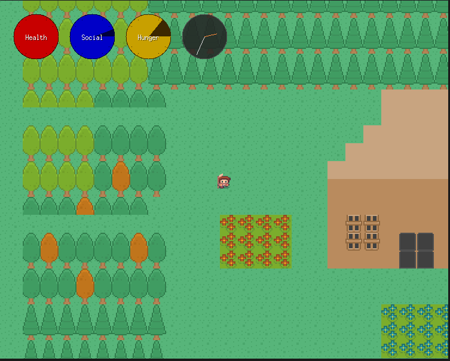

# Survival Game: A Survival Adventure

This is my first game project, written in Go using the Ebiten game library. The game draws inspiration from the survival mechanics and style of "Don't Starve," and is aimed at being a survival game where you must manage your hunger, social needs, and interact with NPCs.

## Example Screenshot

Below is an example screenshot of the game:

## Features
- Top-down 2D graphics
- NPCs with simple conversations
- Inventory and crafting (cooking, eating, gathering wood, fishing)
- Day/night cycle with gradual lighting changes
- Survival mechanics: hunger and social bars drain over time
- Music and sound effects

## Credits
- Inspired by "Don't Starve" by Klei Entertainment
- Built with [Ebiten](https://ebiten.org/)
